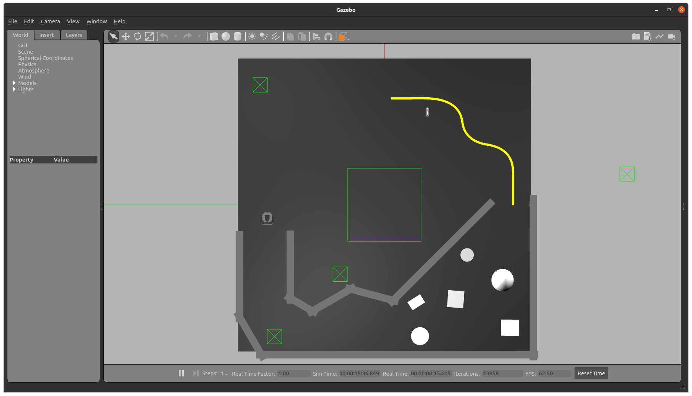
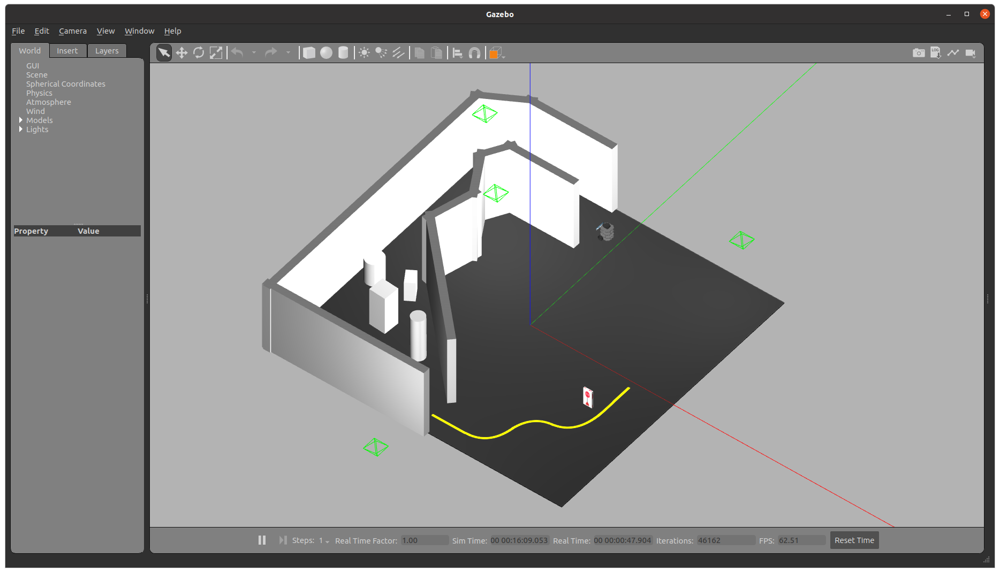

# **AuE8930 Final Project**

Group Members:

1. Pranava Swaroopa | [GitHub](https://github.com/ppswaroopa)

2. Tanmay Chhatbar | [GitHub](https://github.com/TanmayChhatbar)

3. Prasanna Gupta | [GitHub](https://github.com/hthalla)

4. Zainul Belgaumwala | [GitHub](https://github.com/zainul-b)

## **Project Description: Autonomous navigation of Turtlebot**

* ## Task 1: Wall following/Obstacle avoidance

* Successfully follow the wall and avoid the obstacles until it reaches the yellow line.

* ## Task 2: Line following and Stop Sign Detection

* Successfully follow the yellow line.
* While navigating the yellow line, the the Turtlebot should stop at the stop sign for 3 seconds before continuing. The stop-sign will be detected by TinyYOLO.

* ## Task 3: AprilTag tracking

* Spawn and AprilTag in the simulation world and the Turtlebot should track it.

## **Development environment**

* OS: Ubuntu 20.04
* ROS: ROS 1 - Noetic
* Robot: Turtlebot 3 Burger - ROS installed, Camera Installed, Setup and Calibrated.

The catkin workspace aue-finals reside has all external and internal dependencies.

### **Gazebo World**




### External Dependencies (Submodules in this git repo)

1. apriltag
2. aprilrag_ros
3. darknet_ros
4. turtlebot3_simulations

---

## **How to Run**

### **Clone the repo:**

```bash
git clone --recurse-submodules https://github.com/ppswaroopa/Aue8230Spring2022_Group7.git
cd group7_ws
catkin build -DCMAKE_BUILD_TYPE=Release
```

Note

* *For working with darknet_ros you will need to have nvidia-toolkit installed on your system. Otherwise building of darknet_ros will fail.*

* *apriltag and apriltag_ros packages just need to be built*

### **Turtlebot Setup:**

* Setup the robot using: [Quick Start Guide](https://emanual.robotis.com/docs/en/platform/turtlebot3/quick-start/)
* Setup camera access on the Turtlebot 3 Burger.
* Calibrate the camera following the instruction given on this link: [Camera Calibraiton](https://emanual.robotis.com/docs/en/platform/turtlebot3/autonomous_driving/#camera-calibration)
* Brinup Turtlebot and Camera. *You can edit the bringup launch file to load the camera module with it*

```bash
roslaunch turtlebot3_bringup turtlebot3_robot.launch
```

---

### **Running Code**

There are TWO main launch files, One for running it in simulation and the other in real world.

The launch files evoke same nodes but only differ in the subscribers.

* In simulation the camera topic is

```bash
/camera/rgb/image
```

* In the real world based on the camera publisher this topic changes. In our case it was

```bash
/raspicam_node/image
```

* In the real world due to network constraints the 1280x720 image cannot be processed at processing speeds at par with simulation. This meant using a smaller image dimension and compressed images. We utilized the image_transport method to compress and republish the images. In our case the images are available at

```bash
/raspicam_node/image_better
```

### Simulation

To launch the "autobot" node in simulation run:

```bash
roslaunch aue_finals simulation_integration_turtlebot3_autonomy_final.launch
```

### Real World

To launch the "autobot" node in realworld run:

```bash
roslaunch aue_finals real_integration_turtlebot3_autonomy_final.launch
```

---

## **Demo**

[Final Demo on YouTube](https://youtu.be/YXchdEtqzsE)

### Simulation Run

In simulation you can run all the tasks seperately. Hence the launch files will ensure the bot starts at the right spot to start that task. Corresoponding scripts implement the task independent of other tasks.

1. Wall following/Obstacle avoidance:

```bash
roslaunch aue_finals lidar_turtlebot3_autonomy_final.launch
```


2. Line following:

```bash
roslaunch aue_finals follow_line_turtlebot3_autonomy_final.launch
```


3. Stop Sign Detection:

```bash
roslaunch aue_finals stop_sign_turtlebot3_autonomy_final.launch
```


4. AprilTag tracking:

```bash
roslaunch aue_finals april_tag_turtlebot3_autonomy_final.launch
```


### Real World Run

#### Autobot in Action

```bash
roslaunch aue_finals real_integration_turtlebot3_autonomy_final.launch
```

## **Report**

Final Report submitted for Course credit is uploaded [here](https://drive.google.com/file/d/1VUZHVxMLVfufkPdMCAvcL_gCtVaOL2EZ/view?usp=sharing).
